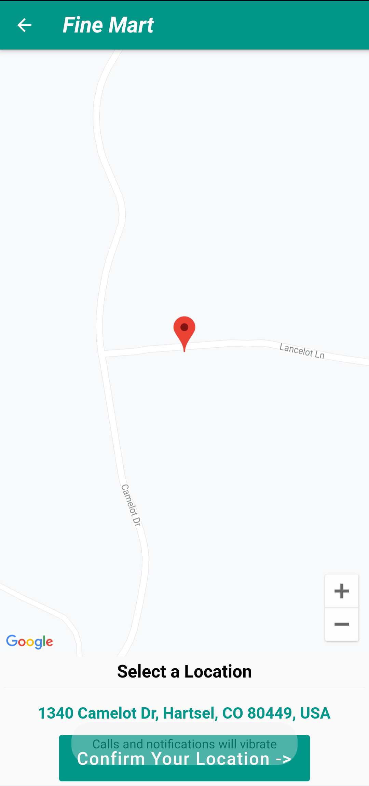
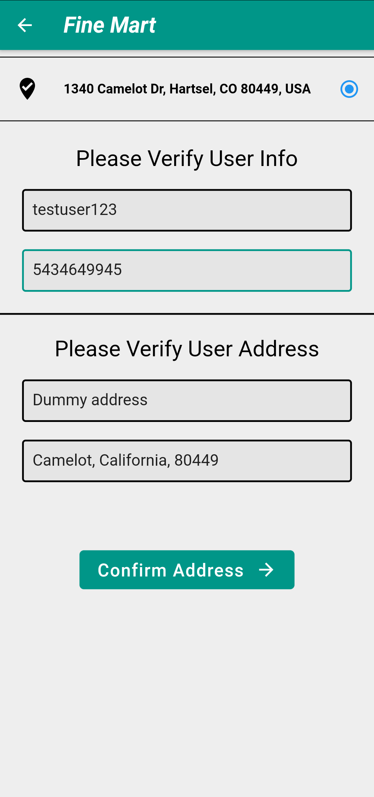
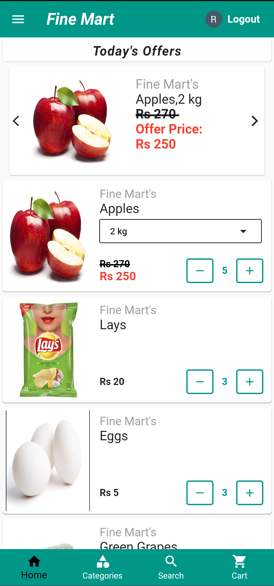
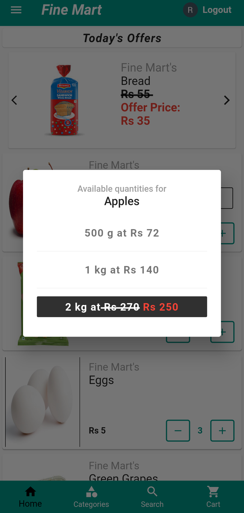
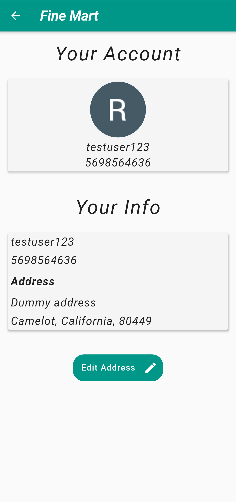
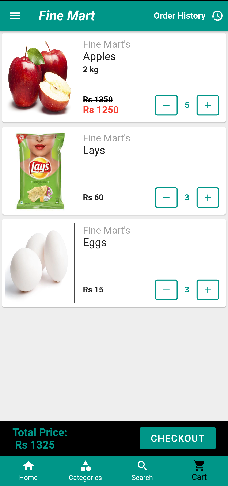
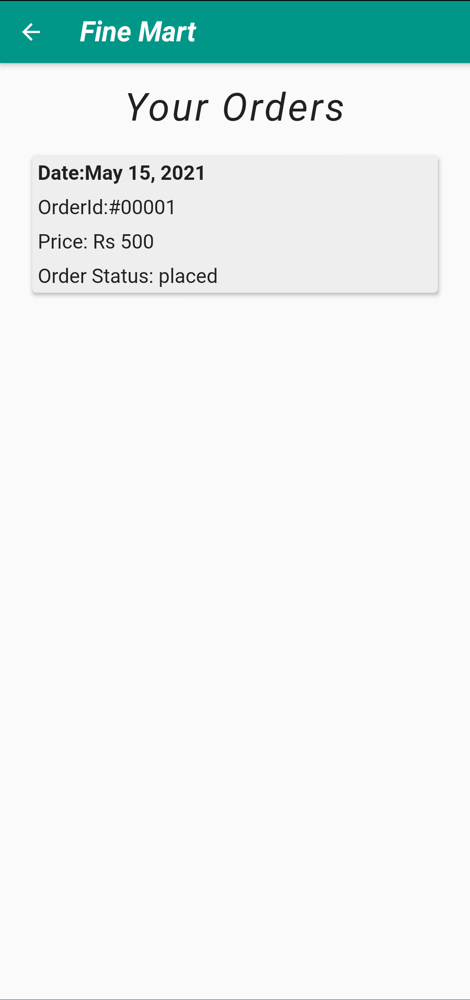
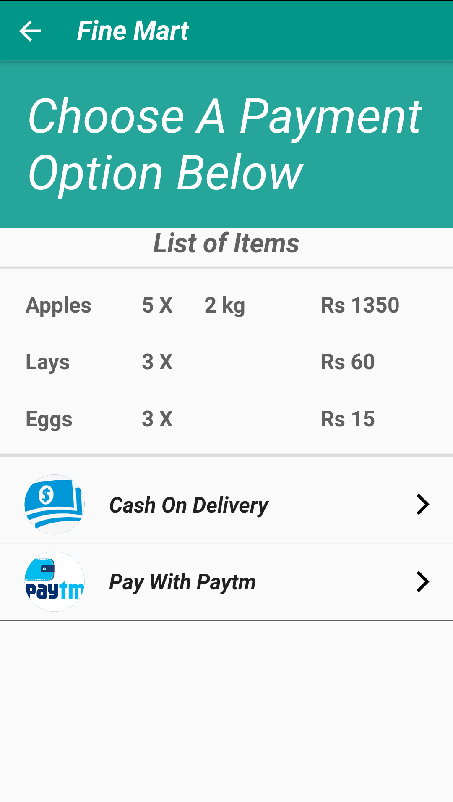

# Finemart

### Finemart is a full stack app built on flutters incredible ui. It is an E-commerce grocery supermarket app. The store is located in Marathalli Bangalore. The store consists of everyday products and at reasonable prices.
 

## Stack used 

* Flutter for Frontend.
* Firebase as the database and server.
* Firebase-Functions for small lambda cloud functions.
* Mongodb for Full-Text search.

 
 

### Login page has both Phone and Google auth.
---

 

### These are the address pages where you can select your location and type in your information.
---
 `--------->`

 

### This the Home page with each item containing its own weight and price. There is also a Profile page which shows all of the users details.
---
 `------>`
`------>`

 

### These are the Cart and Order history pages. The order history pages contains any of your previous orders.
---
 `--------->`

 

### This is the Checkout page. Here you can pay with cash or with paytm.The paytm page takes in either your wallet or your bank details. 
---
 `--------->`

